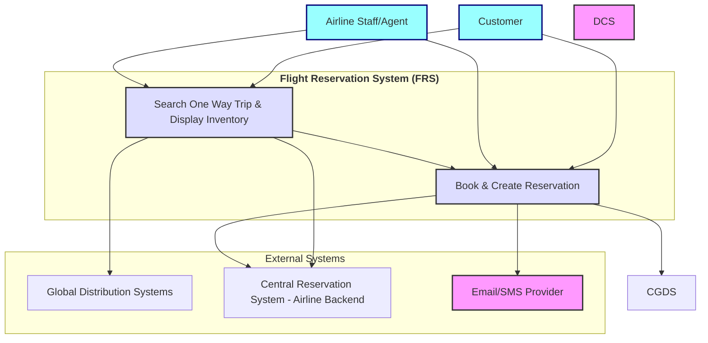
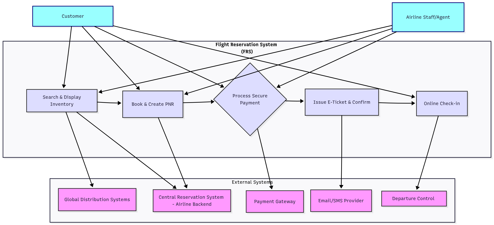

# System Behavior (Use Cases)

## Use Case Diagram

Primary Actors:

- Customer
- Airline Staff /Agent

Use Cases:

- Search One Way Trip & Display Inventory
- Book & Create Reservation

Secondary Actors:

- Global Distribution Systems (GDS)
- Central Reservation System - Airline Backend (CRS)
- Email/SMS Provider

## Use Case Narrative: Search One Way Trip & Display Inventory

### Use Case Name
Search & Display Inventory

### Primary Actor
Customer, Airline Staff/Agent

### Goal
The customer or agent searches for a flight (origin, destination, dates). The FRS must fetch and present an up-to-the-minute list of all available flights, seats, and their current prices.

### Preconditions
- The customer is registered/logged or Guest into the system.

### Main Success Scenario
1. The customer/airline staff selects departure city.
2. The customer/airline staff selects departure airport in the selected city.
3. The customer/airline staff selects destination city.
4. The customer/airline staff selects departure date.
5. The customer/airline staff submits the search for available flights.
4. The system validates the customer inputs.
5. The system retrieves the real time inventory and fare.
6. The system displays the consolidated results to the customer.

### Extensions (Alternative Flows)

- Central Reservation System (CRS) is unavailable:
  - The system notifies the customer that real time inventory and fare data cannot be retrieved at this time.
- Flight tickets are not available:
  - The system notifies the customer and suggests modifying their booking dates and airline preferences.

### Postconditions
- The system displays available flights seats and their prices based on the customer search.

## Use Case Narrative: Book & Create Reservation

### Use Case Name
Book & Create Reservation

### Primary Actor
- Customer, Airline Staff/Agent

### Goal
- Reserve a seat on a selected flight.

### Preconditions
- The customer/airline staff has searched for available flight.

### Main Success Scenario
1. The customer/airline staff selects one flight from the displayed inventory.
2. The system prompts the user to enter passenger information.
3. The system saves the passenger information.
4. The system confirms the flight reservation.

### Extensions (Alternative Flows)
- Missing or invalid passenger detais, the system displays and error message and requests correction.
- Session expired, customer must restart the booking process.

### Postconditions
- Temporaty booking record is created and ready for payment.
