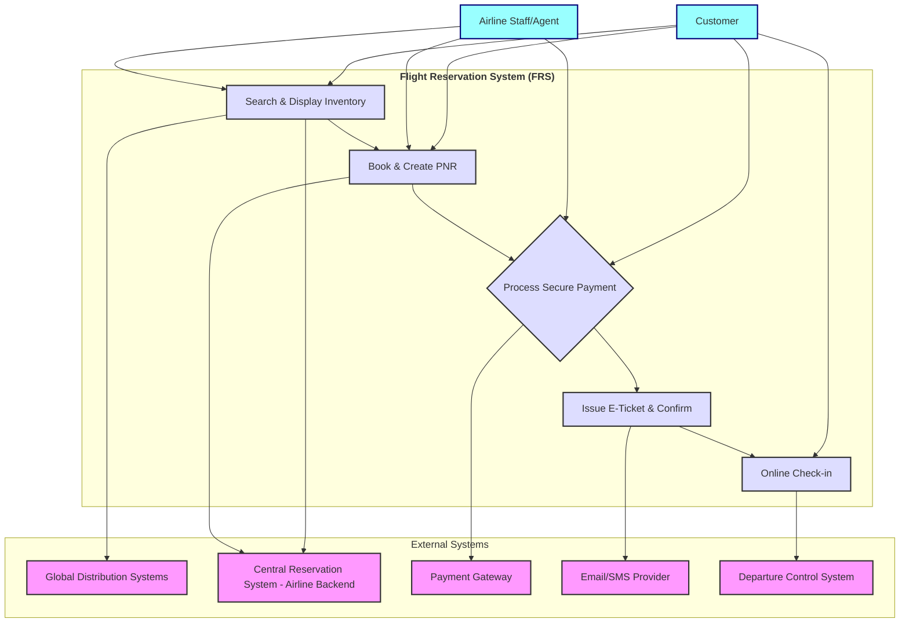

# System Behavior (Use Cases)

## Use Case Diagram

Primary Actors:

- Customer
- Airline Staff /Agent

Use Cases:

- Search & Display Inventory
- Book & Create Reservation PNR
- Process Secure Payment
- Issue E-Ticket & Confirm
- Online Check-in

Secondary Actors:

- Global Distribution Systems (GDS)
- Central Reservation System - Airline Backend (CRS)
- Payment Gateway (PaymentGateway)
- Email/SMS Provider
- Departure Control System (DCS)

## Use Case Narrative: Search & Display Inventory

### Use Case Name

Search & Display Inventory

### Primary Actor

Customer, Airline Staff/Agent

### Goal

The customer or agent searches for a flight (origin, destination, dates). The FRS must fetch and present an up-to-the-minute list of all available flights, seats, and their current prices.

### Preconditions

- The customer is registered/logged or Guest into the system.

### Main Success Scenario

1. The customer enters origin, destination, dates and prefered Airlines.
2. The customer enters number of adult and child passengers.
3. The customer submits the search for available flights.
4. FRS validates the customer inputs.
5. FRS retrieves the real time inevntory and fare date by querrying GDS/Airline API thus intern queries  Central Reservation System (CRS)
6. FRS displays the consolidated results to the customer.

### Extensions (Alternative Flows)

- Central Reservation System (CRS) is unavailable:
  - The system notifies the customer that real time inventory and fare data cannot be retrieved at this time.
- Flight tickets are not available:
  - The system notifies the customer and suggests modifying thier booking dates and airline preferences.

### Postconditions

- FRS displays available flights, seats and thier prices based on the customer inputs
  
  

## Use Case Narrative: Create Reservation PNR

Use Case Name

Book & Create PNR

### Primary Actor

### Goal

### Preconditions

- 

### Main Success Scenario

1. 

### Extensions (Alternative Flows)

- 

### Postconditions

- 
