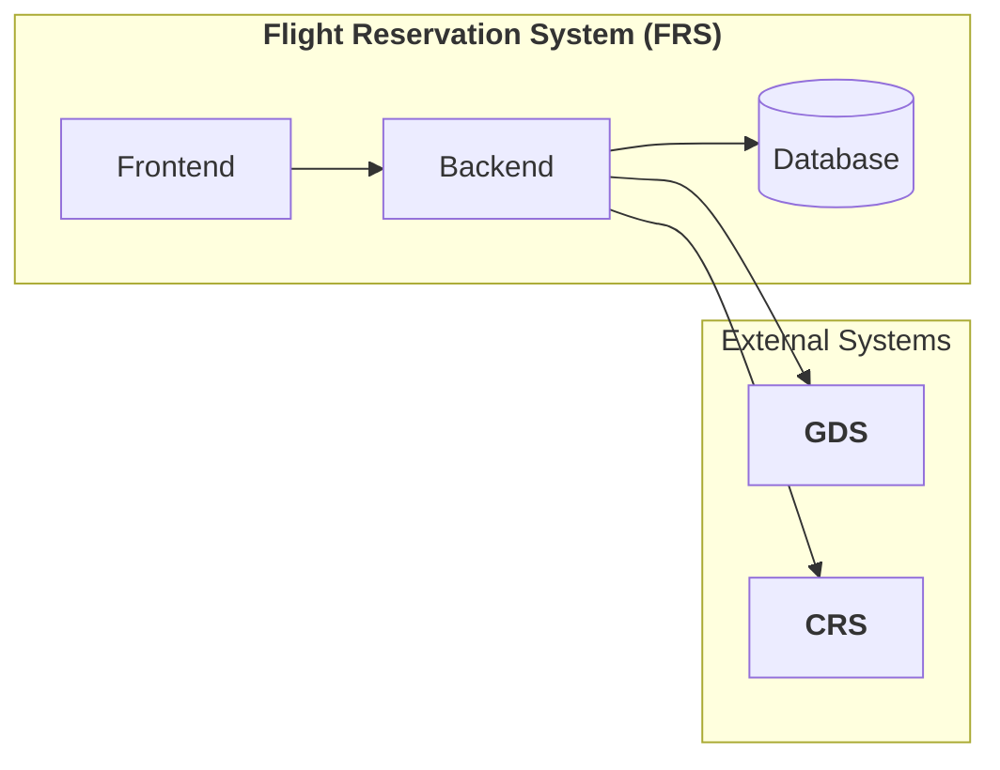

# System Structure

## System Behavior (Architecture)

## Architecture Style

- Monolith

## Architecture Diagram

Frontend and Monolithic Backend  mimicing the real life project.

## Tech Stack

Programming Languages:

- Java
- Angular

Database:

- MariaDB

## Repository Strategy

Mono-repo Repository Structure

[Flight Reservation System Repository](https://github.com/ArkCase/atdd-flight-reserve)
