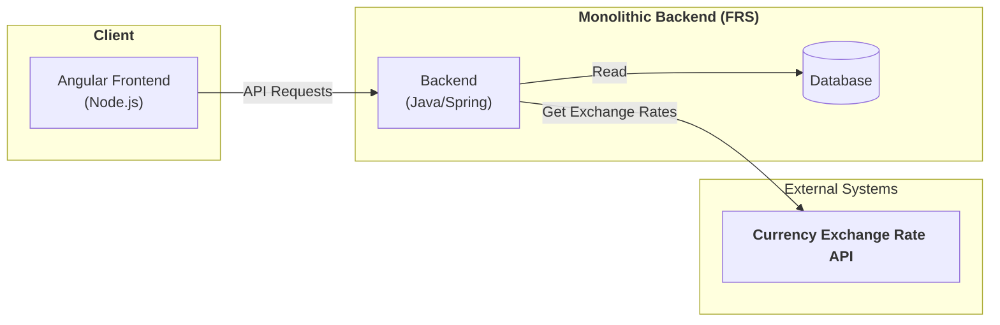

# System Structure

## System Behavior (Architecture)

## Architecture Style

- Frontend + Monolithic Backend

## Architecture Diagram

```mermaid
flowchart LR
 subgraph Client["<b>Client</b>"]
        FE["Angular Frontend<br/>(Node.js)"]
  end
 subgraph Monolith["<b>Monolithic Backend (FRS)</b>"]
        BE["Backend<br/>(Java/Spring)"]
        DB[("Database")]
  end
 subgraph subGraph1["External Systems"]
        CurrencyAPI["<b>Currency Exchange Rate API</b>"]
  end
    FE -->|"API Requests"| BE
    BE -->|"Read"| DB
    BE -->|"Get Exchange Rates"| CurrencyAPI
```

## Tech Stack

Programming Languages:

- Java
- Angular

Database:

- MySQL

## Repository Strategy

Mono-repo Repository Structure with multiple components API + Client

[Flight Reservation System Repository](https://github.com/ArkCase/atdd-flight-reserve)
